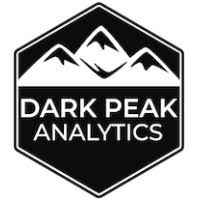

<style type="text/css">
.main-container {
  max-width: 20000px;
  margin-left: 50px;
  margin-right: 50px;
  margin-bottom: 50px;
}
</style>

<p><a href="https://darkpeakanalytics.com/">
  
</a></p>       


```{r, echo=FALSE}

yellowhex <- "#ebc622"
redhex <- "#bd0000"
greenhex <- "#5ec22c"

CountryVec <- c(
  "Australia",
  "Belgium",
  "Canada",
  "Denmark",
  "England",
  "Finland",
  "France",
  "Germany",
  "Ireland",
  "Italy",
  "Norway",
  "Poland",
  "Portugal",
  "Scotland",
  "Spain",
  "Sweden",
  "The Netherlands"
)

```


<style>
    .HTAtable {
        width: 100%;
    }
    .HTAtable th {
        background: #d3d3d2;
        word-wrap: break-word;
        text-align: center;
    }
    .HTAtable tr:nth-child(`r which(CountryVec == "Australia")`) td:nth-child(3) { background: `r yellowhex`;color:black; }
    .HTAtable tr:nth-child(`r which(CountryVec == "Belgium")`) td:nth-child(5) { background: `r redhex`;color:white; }
    .HTAtable tr:nth-child(`r which(CountryVec == "Canada")`) td:nth-child(3) { background: `r yellowhex`;color:black; }
    .HTAtable tr:nth-child(`r which(CountryVec == "Canada")`) td:nth-child(5) { background: `r greenhex`;color:black; }
    .HTAtable tr:nth-child(`r which(CountryVec == "Denmark")`) td:nth-child(3) { background: `r redhex`;color:white; }
    .HTAtable tr:nth-child(`r which(CountryVec == "Denmark")`) td:nth-child(5) { background: `r redhex`;color:white; }
    .HTAtable tr:nth-child(`r which(CountryVec == "England")`) td:nth-child(3) { background: `r greenhex`;color:black; }
    .HTAtable tr:nth-child(`r which(CountryVec == "England")`) td:nth-child(5) { background: `r greenhex`;color:black; }
    .HTAtable tr:nth-child(`r which(CountryVec == "Finland")`) td:nth-child(3) { background: `r greenhex`;color:black; }
    .HTAtable tr:nth-child(`r which(CountryVec == "Finland")`) td:nth-child(5) { background: `r greenhex`;color:black; }
    .HTAtable tr:nth-child(`r which(CountryVec == "Germany")`) td:nth-child(5) { background: `r greenhex`;color:black; }
    .HTAtable tr:nth-child(`r which(CountryVec == "Ireland")`) td:nth-child(3) { background: `r yellowhex`;color:black; }
    .HTAtable tr:nth-child(`r which(CountryVec == "Ireland")`) td:nth-child(5) { background: `r greenhex`;color:black; }
    .HTAtable tr:nth-child(`r which(CountryVec == "Italy")`) td:nth-child(3) { background: `r redhex`;color:white; }
    .HTAtable tr:nth-child(`r which(CountryVec == "Norway")`) td:nth-child(3) { background: `r greenhex`;color:black; }
    .HTAtable tr:nth-child(`r which(CountryVec == "Norway")`) td:nth-child(5) { background: `r greenhex`;color:black; }
    .HTAtable tr:nth-child(`r which(CountryVec == "Poland")`) td:nth-child(3) { background: `r yellowhex`;color:black; }
    .HTAtable tr:nth-child(`r which(CountryVec == "Portugal")`) td:nth-child(3) { background: `r yellowhex`;color:black; }
    .HTAtable tr:nth-child(`r which(CountryVec == "Scotland")`) td:nth-child(5) { background: `r yellowhex`;color:black; }
    .HTAtable tr:nth-child(`r which(CountryVec == "Sweden")`) td:nth-child(5) { background: `r greenhex`;color:black; }
    .HTAtable tr:nth-child(`r which(CountryVec == "The Netherlands")`) td:nth-child(3) { background: `r greenhex`;color:black; }
    .HTAtable tr:nth-child(`r which(CountryVec == "The Netherlands")`) td:nth-child(5) { background: `r greenhex`;color:black; }
    .HTAtable, tr {
        border: 1px solid #9c9e9b;
    }
</style>


---

This document is intended to be a living document for individual country guidance on the use of R models as evidence in HTA submissions. This consists of both available guidance from individual HTA websites, with references, but also correspondence with individual organisations. The correspondence with each HTA agency has been made via the 'contact us' information provided on each website. 

**Disclaimer:** This document is a guide only; the author holds no responsibility for where information here differs from individual experiences. We encourage anyone interested in submitting to a HTA agency to follow the published guidance and reach out to the individual agencies to confirm acceptance based on your individual circumstance. 


This document is to be referenced as: Hart R, Use of R models for HTA submission, 2025, https://doi.org/10.5281/zenodo.15056439

The code for this document is hosted on GitHub at: https://github.com/dark-peak-analytics/HTA_acceptance_living_document

Notice something wrong or missing? Contact us at rhart@darkpeakanalytics.com with more information and we will try to incorporate it"


```{r include=FALSE}
library(fontawesome)
``` 

---

<b><u>Key</b></u>


- `r fa(name = "circle", fill = greenhex, height = "1em", prefer_type = "solid")`: R models can be accepted. Please see individual cells for specifics surrounding acceptance
- `r fa(name = "circle", fill = redhex, height = "1em",prefer_type = "solid")`: R models cannot be accepted at this time.
- `r fa(name = "circle", fill = yellowhex, height = "1em",prefer_type = "solid")`: R models may be accepted, but guidance either does not specify R outright as an acceptable option or states that discussion will be needed on the rationale for using R before deciding whether it is appropriate


<br>

<div class="HTAtable">


| Country    | Agency                                  | Available guidance from agency website | Reference | Additional guidance from correspondence | Additional notes |
|:----------|:---------------------------------------|:--------------------------------------|:-----------|:---------------------------------------|:----------------|
| Australia  | Pharmaceutical Benefits Advisory Committee (PBAC) | States that TreeAge Pro and Excel 2010 are the only software that can be used without pre-arrangement<br><br> Requirements of submission: <br>• Access to the electronic copy of the evaluation <br> • Ensure that variables can be changed independently<br> • Can produce results within 'reasonable running times'| <a href = "https://pbac.pbs.gov.au/information/printable-version-of-guidelines.html">Link</a> <br>Version 5 (September 2016) | Awaiting reply |   |
| Belgium |National Health Insurance and Disability Institute (INAMI)| Software preference not specified | <b>To add</b> | R is not currently accepted (March 2025) | |
| Canada |Canada's Drug Agency (CDA)| <b>To fill in details</b> | <a href = "https://www.cda-amc.ca/procedures-reimbursement-reviews">Link</a> <br> (September 2024) | <b>Will accept R – To fill in details</b> | |
| Denmark |Danish Medicines Council (DMC)| “The health economic analysis and budget impact analysis must be submitted in Excel format.” | <a href = "https://medicinraadet-dk.b-cdn.net/media/huyhssl2/the-danish-medicines-councils-process-guide-for-assessing-new-pharmaceuticals-version-1-2.pdf">Link</a> <br> (June 2022) | R is not currently accepted (March 2025) | |
| England |National Institute for Health and Care Excellence (NICE)| <b>To fill in details</b> | <a href = "https://www.nice.org.uk/process/pmg36/resources/nice-health-technology-evaluations-the-manual-pdf-72286779244741">Link</a> <br> (October 2023) | <b>To fill in details / inquire on specifics </b> | |
| Finland |Pharmaceuticals Pricing Board (NICE)| <b>To fill in details</b> | <a href = "https://www.hila.fi/content/uploads/2024/06/Instructions_TTS_2024_190624.pdf">Link</a> <br> (June 2024) | <b>To fill in details / inquire on specifics </b> | |
| France |Haute Autorité de Santé (HAS)| Software preference not specified | <a href = "https://www.has-sante.fr/upload/docs/application/pdf/2014-03/pricing_reimbursement_of_drugs_and_hta_policies_in_france.pdf">Link</a> <br> (March 2014) | Awaiting reply | |
| Germany |Institute for Quality and efficiency in Health Care (IQWiG)| Software preference not specified - <b>To fill in details and confirm if there is more detail in the German guidance</b>  | <a href = "https://www.iqwig.de/en/about-us/methods/methods-paper/">Link</a> <br>Version 7 (September 2023) | <b>Will accept R – To fill in details</b> | |
| Ireland |National Centre for Pharmacoeconomics (NCPE)| <b>To fill in details</b>  | <a href = "https://www.ncpe.ie/submission-process/submission-templates/format-of-full-submissions/">Link</a> <br>Version 3.1 (March 2023) | <b>Will accept R – To fill in details</b> | |
| Italy |Italian Medicines Agency (AIFA)| “The data and models used must be made available at the same time in Excel or TreeAge format” (translated)  | <a href = "https://www.aifa.gov.it/en/linea-guida-capitolo-9">Link</a> <br>(January 2021) | Awaiting reply | |
| Norway |Norwegian Medicines Agency (NoMA)| <b>To fill in details</b> | <a href = "https://www.dmp.no/globalassets/documents/english/public-funding-and-pricing/documentation-for-sta/guidelines-20.05.2020.pdf ">Link</a> <br> (May 2020) | <b>To fill in details / inquire on specifics </b> | |
| Poland |Agency for Health Technology Assessment and Tariff System (AOTM)| <b>To fill in details</b> | <a href = "https://www.aotm.gov.pl/en/guidelines/">Link</a> <br> Version 3 (August 2016) | Awaiting reply | |
| Portugal |Health Technology Assessment Committee (Infarmed)| <b>To fill in details</b> | <a href = "https://www.infarmed.pt/web/infarmed/entidades/medicamentos-uso-humano/avaliacao-tecnologias-saude/avaliacao-terapeutica-e-economica2018/-i-guidelines-/i-">Link</a> <br> Version 1 (December 2019) | Awaiting reply | |
| Scotland |Scottish Medicines Consortium (SMC)| Software preference not specified - <b>To confirm and add detail</b>| <a href = "https://scottishmedicines.org.uk/making-a-submission/">Link</a> <br> <b>To add date</b>) | <b>To fill in details</b> | |
| Spain |<b>To confirm<b>| <b>To fill in</b>| <b>To add</b> | Investigating and Awaiting reply | |
| Sweden |Dental and Pharmaceutical Benefits Agency (TLV)| Software preference not specified - <b>To confirm and add detail</b>| <a href = "https://www.tlv.se/lakemedelsforetag/halsoekonomiska-bedomningar-och-rapporter-kliniklakemedel.html">Link</a> <br> (February 2025) | <b>To fill in details</b> | |
|The Netherlands |National Health Care Institute (ZiN)| <b>To fill in details</b> | <a href = "https://english.zorginstituutnederland.nl/publications/publications/2022/12/15/guideline-for-building-cost-effectiveness-models-in-r">Link</a> <br> (December 2022) | <b>To fill in details /  specifics </b><br> Awaiting reply| |


</div>


